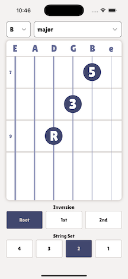

# Triad Trainer

Just playing around with [react-native-skia](https://shopify.github.io/react-native-skia/)

I might develop this into a guitar tutorial for learning/practicing triads.

Currently you can use it to display fretboard diagrams for guitar triads.

